# Pangkal Pinang Super App — Ecosystem

A back-end stack for the Pangkal Pinang citizen super-app. It lets a Flutter
mobile app sign citizens in through the city's existing **Keycloak** SSO
without ever giving the app a Keycloak token, while letting any number of
business microservices accept authenticated requests without writing a line
of OAuth code.

The trick is a **Backend-for-Frontend (BFF)** that owns the OAuth ceremony
and mints its own short-lived **RS256 internal JWTs**. The mobile app
carries that internal JWT as a Bearer. **Kong** validates it at the gateway
with the matching public key — Kong never talks to Keycloak, never sees the
private key, and never has to be customised. Downstream services trust
Kong's verdict and read the user's identity from signed `X-User-Id` /
`X-Roles` headers.

> **New to the repo?** Read this README top-to-bottom — every concept has a
> diagram next to it. Deeper docs are linked at the end.

---

## Architecture at a glance

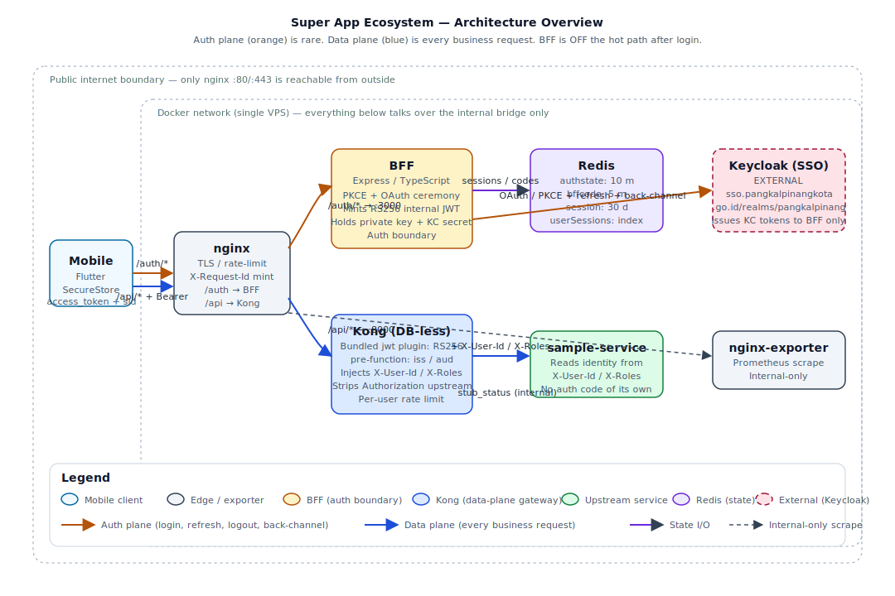

- **Mobile** is the only public client. It holds the internal JWT and a
  session id in `flutter_secure_storage`. Nothing else.
- **nginx** is the only thing exposed to the internet. It terminates TLS,
  mints `X-Request-Id`, applies per-IP rate limits, and routes by path:
  `/auth/*` → BFF, `/api/*` → Kong.
- **BFF** is the auth boundary. It speaks OAuth/PKCE to Keycloak, signs
  internal JWTs, manages Redis-backed sessions, and serves the `/auth/me`
  profile endpoint. **Nothing else in the stack talks to Keycloak.**
- **Kong** is the data-plane gateway. It verifies the internal JWT against
  the public PEM, enforces `iss` / `aud`, strips any caller-supplied
  identity headers, injects trusted ones, drops the bearer before
  forwarding, and rate-limits per user.
- **Services** (here represented by `sample-service`) trust the headers
  Kong injects and write zero auth code.
- **Redis** stores session records and short-lived OAuth handshake state.
  Only the BFF reads or writes it.
- **Keycloak** is external (`sso.pangkalpinangkota.go.id`); not deployed
  by this stack.

---

## The two-plane mental model

Auth is rare (login, refresh, logout). Business calls are constant. We
deliberately split them so that **the BFF is off the hot path** after a
user logs in:

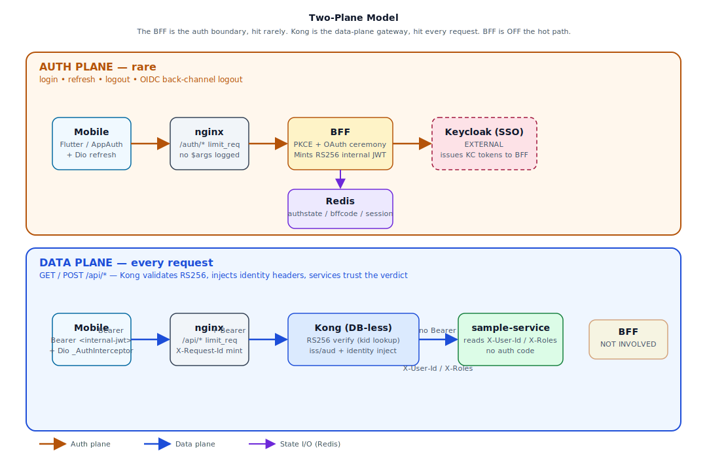

| Operation | Frequency | Touches BFF? |
|---|---|---|
| Login | once per session | **yes** |
| Refresh internal JWT | every ~5 min | **yes** |
| Logout | once | **yes** |
| `GET /api/profile`, `POST /api/...` | every user action | **no — Kong handles it** |

This is what lets the system scale to many services without each one
re-implementing auth.

---

## How authentication works

### Login — double PKCE through the BFF

The mobile app never opens a window onto Keycloak. AppAuth talks to the
BFF's `/auth/authorize`; the BFF redirects out to Keycloak using its **own**
PKCE pair; after Keycloak comes back, the BFF mints the internal JWT and
hands it to the app.

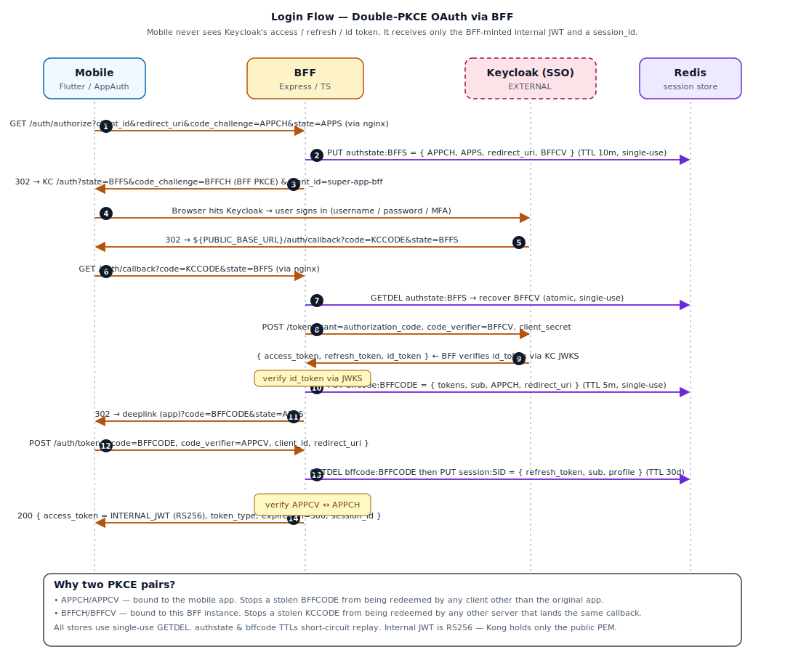

Two PKCE pairs — one for the mobile → BFF leg (`APPCH` / `APPCV`), one for
the BFF → Keycloak leg (`BFFCH` / `BFFCV`). Each protects its leg in
isolation; a stolen code on either leg is useless without the matching
verifier. Both handshake records (`authstate:`, `bffcode:`) are single-use
and atomically deleted via Redis `GETDEL`.

### Refresh — transparent re-mint on a 401

The internal JWT lives 5 minutes. When Kong sees an expired one it returns
401; the mobile Dio interceptor catches that, calls `/auth/refresh` with
the (possibly expired) bearer plus session id, then retries the original
request once with the new bearer. The user never notices.

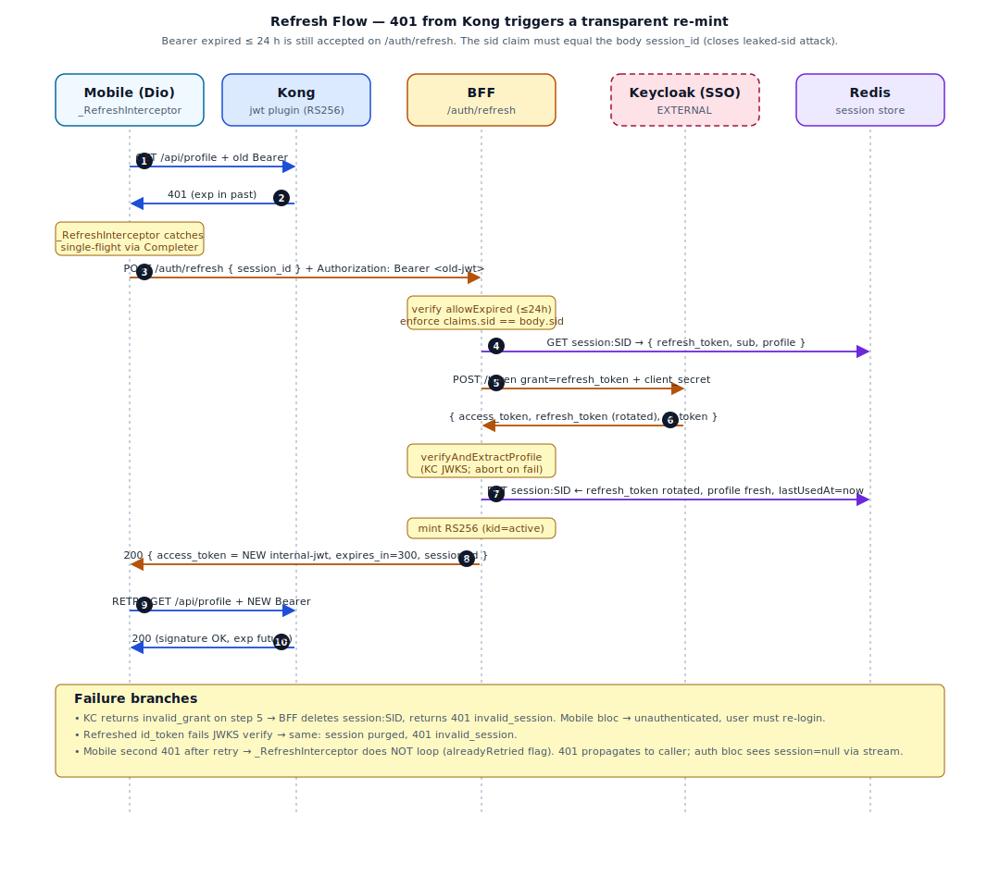

`/auth/refresh` requires the bearer **plus** that `bearer.sid` equals the
posted `session_id`. A leaked `session_id` alone is not enough — the
attacker also needs a token bound to that session.

### Logout — local + Keycloak-initiated

Two paths can end a session:

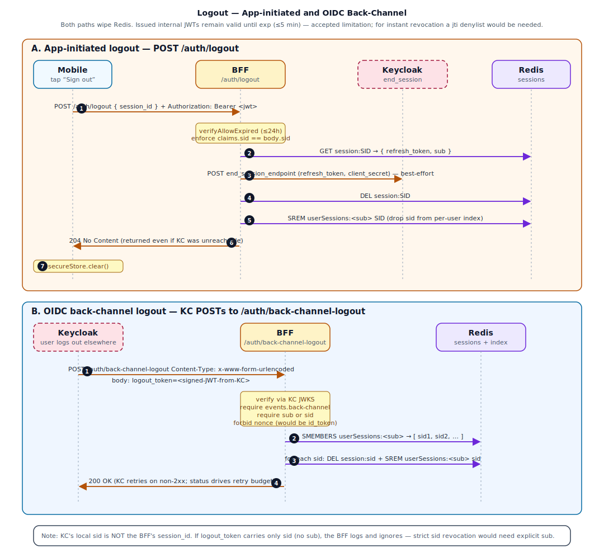

- **App-initiated:** mobile calls `/auth/logout`. The BFF best-effort ends
  the Keycloak session, then wipes Redis. 204 even if Keycloak is
  unreachable — local state is the source of truth.
- **OIDC back-channel:** if the user logs out in another channel,
  Keycloak POSTs a signed `logout_token` to `/auth/back-channel-logout`.
  The BFF verifies it against Keycloak's JWKS, then uses the
  `userSessions:<sub>` index to find and delete every session for that
  user.

In both cases, internal JWTs already issued remain valid until their `exp`
(≤5 minutes). For instant revocation we would need a `jti` denylist Kong
checks — deferred until justified.

---

## Every-request path (the 99% case)

Once authenticated, every business call goes mobile → nginx → Kong →
service. The BFF is **not** in this path.

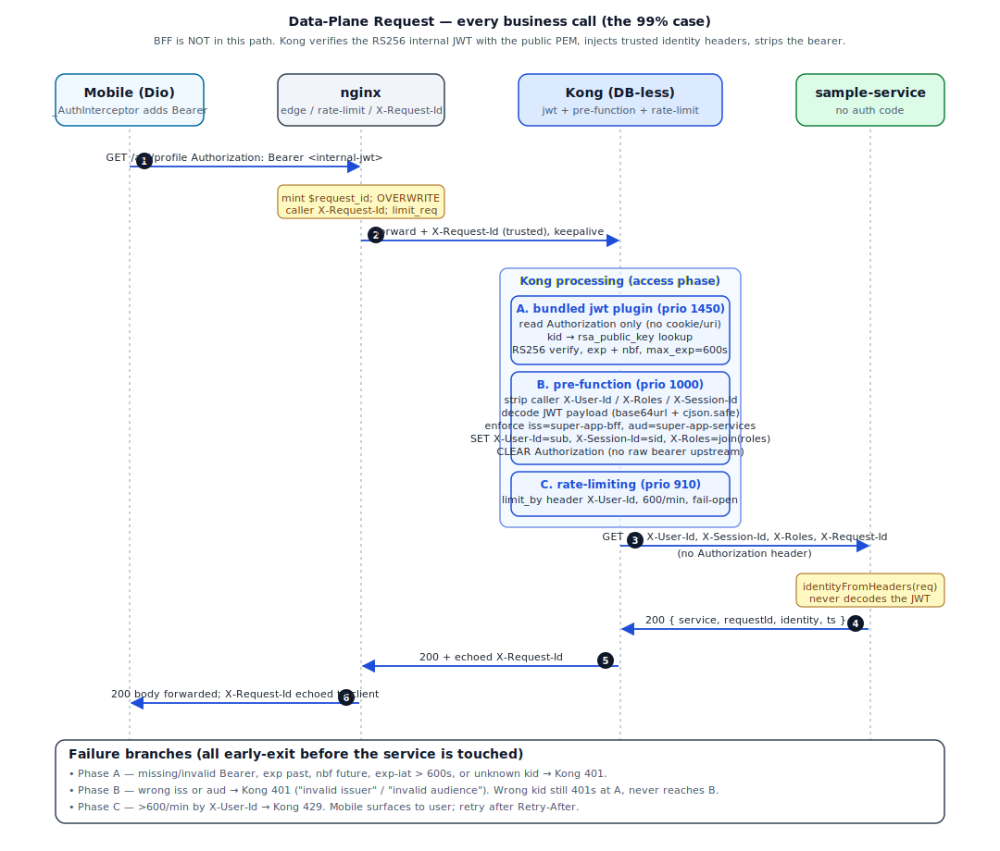

Kong's access phase has three stacked plugins. The order is load-bearing:

1. **bundled `jwt` plugin** (priority 1450) — RS256 signature, `exp`,
   `nbf`, `maximum_expiration: 600s`, header-only carrier.
2. **`pre-function`** (priority 1000) — strips inbound identity headers,
   decodes the verified payload, enforces `iss` / `aud`, sets trusted
   `X-User-Id` / `X-Session-Id` / `X-Roles`, clears `Authorization`.
3. **`rate-limiting`** (priority 910) — per-user limit keyed by the
   freshly-injected `X-User-Id`.

If any step fails the upstream service never sees the request.

---

## How Kong injects identity (and resists header spoofing)

A naive upstream that trusted `X-User-Id` from anyone would be trivial to
exploit by sending `X-User-Id: admin` directly. Kong's pre-function plugin
strips first, decodes second, sets last — and removes the bearer on the
way out:

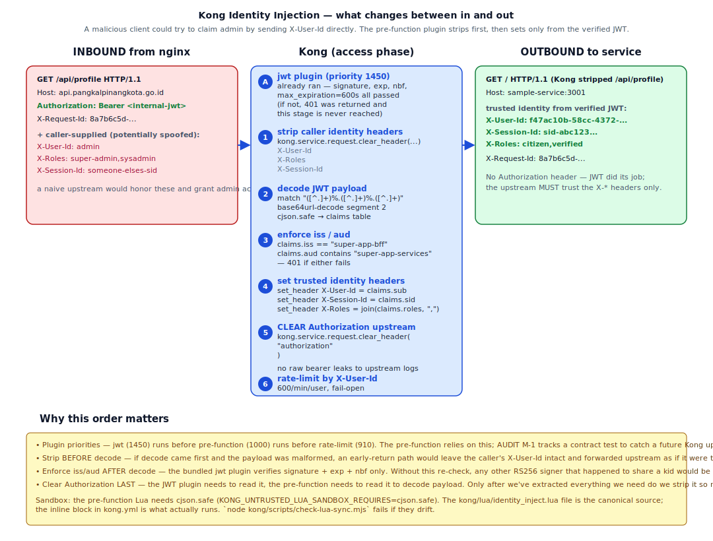

Service code reads `req.headers['x-user-id']` and `x-roles` and trusts
them as authoritative. It never decodes the JWT. The reference upstream is
`services/sample-service/src/index.ts` — a few dozen lines, no auth
library.

---

## The internal JWT

Algorithm: **RS256**. TTL: **5 minutes**. The BFF holds the private key in
memory; Kong has only the public PEM, keyed by `kid`. The `kid` appears in
**both** the JWT header (RFC 7515 standard) and the payload (so Kong's
bundled `jwt` plugin can look up the credential via `key_claim_name=kid`).

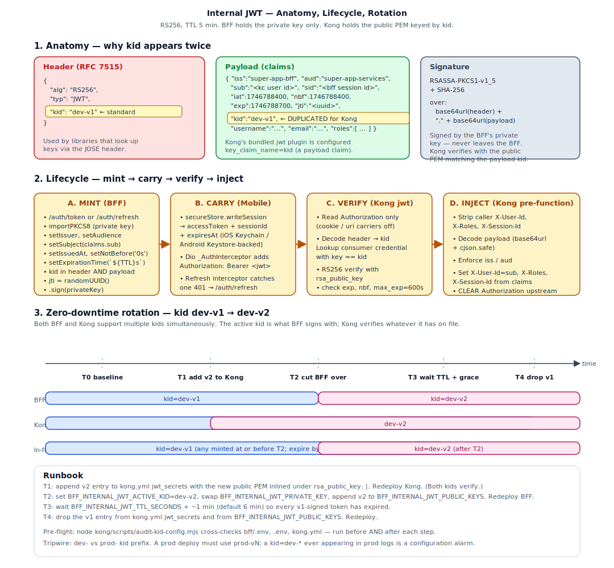

**Rotation** is zero-downtime: BFF and Kong both accept multiple kids at
once. Add the new kid at Kong → cut the BFF over → wait `TTL + grace` for
old tokens to expire → drop the old kid. The `dev-` / `prod-` kid prefix
is a tripwire — a `kid=dev-*` ever appearing in a prod log is a
configuration alarm.

Runbook lives in [`bff/README.md`](bff/README.md) and
[`kong/README.md`](kong/README.md). A pre-flight script
(`node kong/scripts/audit-kid-config.mjs`) cross-checks the four files
that need to agree on the active kid.

---

## Trust boundaries — who sees what

The single most useful diagram in this README. Most cells are blank — by
design.

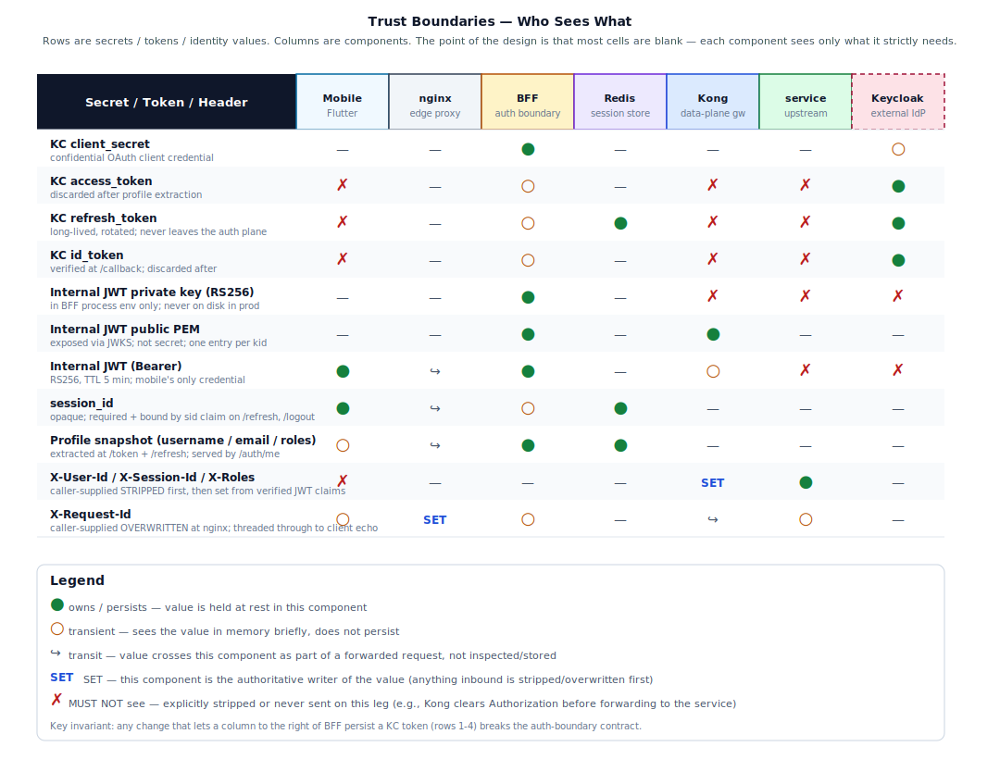

Key invariants:

- **Keycloak tokens** (access / refresh / id) never leave the BFF. The
  refresh token at rest is in Redis only.
- **The internal-JWT private key** is in the BFF process env. Nothing
  else, ever.
- **The mobile app** holds only the internal JWT and the session id.
- **Services** see verified identity in `X-User-Id` / `X-Roles` and
  **never** the raw bearer — Kong strips it.

Anything that changes a column to the right of the BFF to "own" a KC
token breaks the auth-boundary contract.

---

## Redis keyspace (BFF state)

Four key families. Two are short-lived single-use OAuth handshake records,
one is the long-lived session, one is a reverse index that makes
back-channel logout O(k) instead of O(n) SCAN.

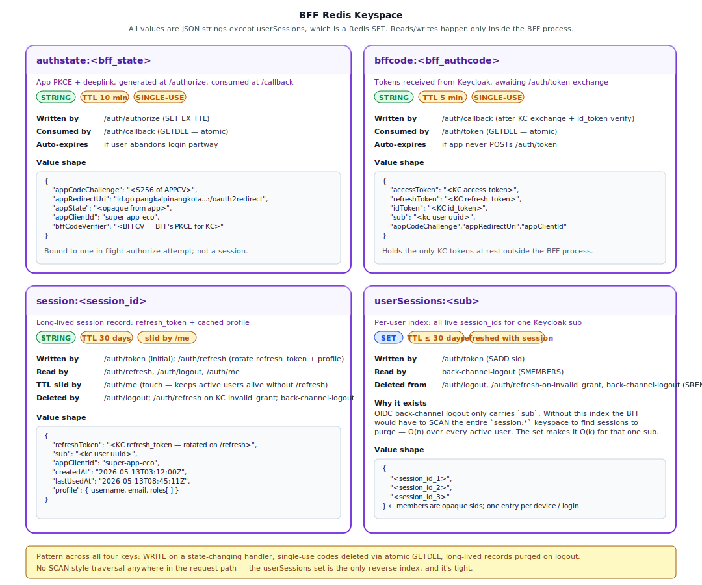

Only the BFF reads or writes Redis. The service tier never sees it.

---

## Request correlation — `X-Request-Id`

Every request line in the system (nginx, Kong, BFF, services, and the
echoed response) carries the same id, so a 5xx in any log can be tied
back to one client request:

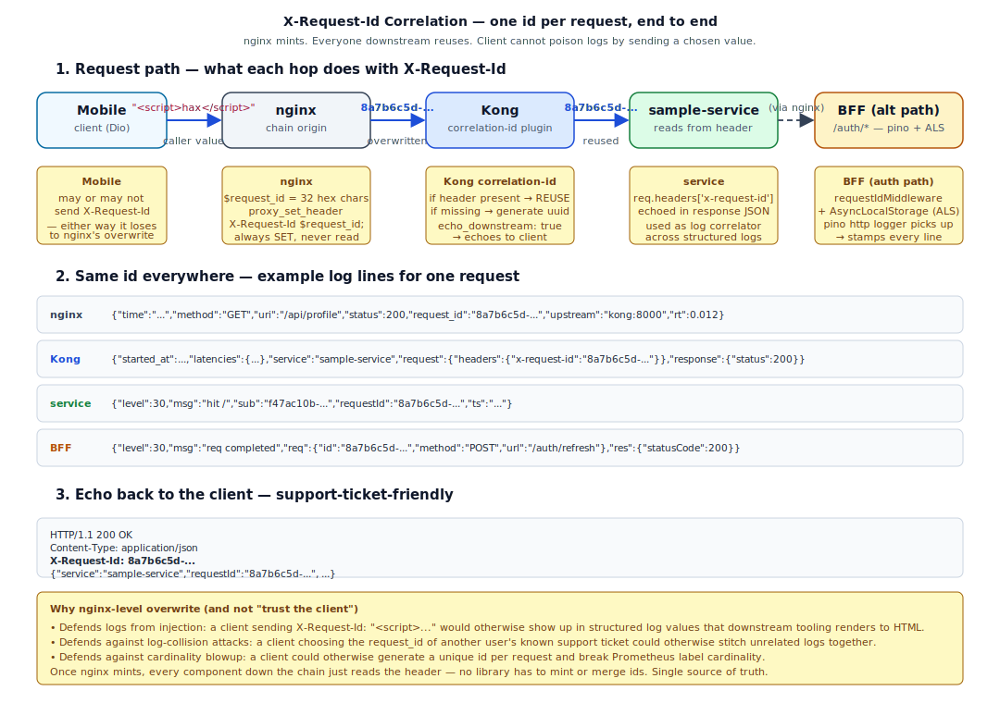

nginx is the chain origin. It mints `$request_id` and uses
`proxy_set_header X-Request-Id $request_id`, which **overwrites** anything
the client sent — log poisoning is impossible. Kong's `correlation-id`
plugin reuses what's already set, propagates it to the upstream, and
echoes it back to the client (`echo_downstream: true`).

---

## Mobile app structure

`mobile/` is a deliberate auth-stack test harness — the design is to copy
`mobile/lib/core/` and `mobile/lib/features/auth/` into other apps. A
`USE_MOCK_AUTH=true` toggle lets screen work proceed without the backend.

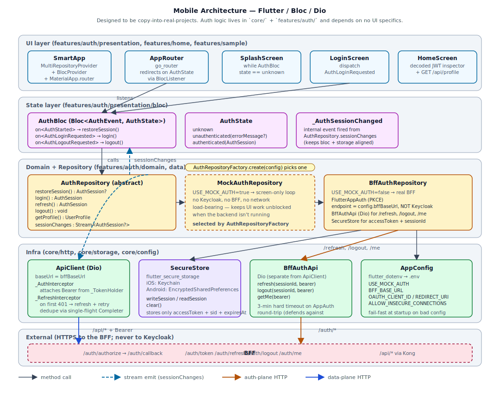

The `sessionChanges` stream is the load-bearing piece — both `AuthBloc`
and the Dio `ApiClient._TokenHolder` subscribe to it, so a refresh or
logout in one place is reflected everywhere without a global singleton.

---

## Components

| Dir | What | Trust boundary |
|---|---|---|
| [`bff/`](bff/) | Express + TypeScript. Owns the OAuth/PKCE ceremony, the Keycloak `client_secret`, the **RS256 signing key**, and the Redis-backed session store. The **auth boundary**. | Only thing that talks to Keycloak. |
| [`nginx/`](nginx/) | Edge reverse proxy. TLS termination (opt-in), per-IP rate limits, default-server sink, ACME webroot, security headers, `X-Request-Id` minting. The **edge boundary**. | Only thing exposed to the public internet. |
| [`kong/`](kong/) | DB-less Kong. Validates BFF-minted JWTs by `kid` against the matching RSA public key, enforces `iss`/`aud`, strips inbound identity headers, injects trusted ones, drops the bearer before forwarding. The **data-plane gateway**. | Forwards to internal services only. |
| [`services/sample-service/`](services/sample-service/) | Tiny Express service behind Kong — the reference for reading identity from `X-User-Id` / `X-Session-Id` / `X-Roles` headers without any auth code of its own. | Reads identity headers; never decodes JWT. |
| [`mobile/`](mobile/) | Flutter user app. Holds `access_token` (internal JWT) + `session_id` in `flutter_secure_storage`. AppAuth speaks to the **BFF**, never Keycloak. | Never sees a Keycloak token or refresh token. |
| [`docs/`](docs/) | Architecture, deployment, and diagram sources. | — |

---

## Endpoint surface

| Plane | Method | External path | Behind | Purpose |
|---|---|---|---|---|
| auth | `GET`  | `/auth/authorize`           | BFF  | OAuth-shaped entry. Validates app PKCE + `redirect_uri` allowlist, redirects browser to Keycloak with the BFF's own PKCE pair. |
| auth | `GET`  | `/auth/callback`            | BFF  | Keycloak redirects here. BFF exchanges `code`, verifies `id_token` against KC JWKS, stores tokens under a one-time `bff_authcode`, redirects to the app deeplink. |
| auth | `POST` | `/auth/token`               | BFF  | App PKCE verify → mints first internal JWT + creates Redis session. |
| auth | `POST` | `/auth/refresh`             | BFF  | Bearer + `session_id` → rotate Keycloak refresh, re-verify, mint a fresh internal JWT. Bearer expired ≤24 h is accepted. |
| auth | `POST` | `/auth/logout`              | BFF  | Bearer + `session_id` → end Keycloak session + wipe Redis. 204 even if upstream is unreachable. |
| auth | `GET`  | `/auth/me`                  | BFF  | Bearer (strict, no grace) → profile snapshot from the session record. Slides the session TTL. |
| auth | `POST` | `/auth/back-channel-logout` | BFF  | Keycloak posts a signed `logout_token` here; BFF deletes every session for that `sub`. |
| meta | `GET`  | `/.well-known/jwks.json`    | BFF  | JWKS for the internal-JWT public keys. |
| data | `*`    | `/api/profile`, `/api/...`  | Kong | Authenticated business calls. Kong validates the JWT, injects identity headers, strips the bearer, applies per-user rate limit (`X-User-Id`, 600/min). |
| ops  | `GET`  | `/healthz`                  | BFF  | Liveness. Cheap, no I/O. |
| ops  | `GET`  | `/readyz`                   | BFF  | Readiness. Pings Redis + Keycloak discovery (1 s each). 503 on any fail. |
| ops  | `GET`  | `/livez`                    | BFF  | Liveness + event-loop p99 check. |
| ops  | `GET`  | `/nginx-health`             | nginx| Edge liveness. Doesn't touch upstreams. |
| ops  | `GET`  | `/metrics`                  | BFF  | prom-client metrics. Gated by `METRICS_ENABLED`. **Never expose publicly.** |

Mobile only ever talks to `/auth/*` (auth plane) and `/api/*` (data plane).

---

## Quickstart — local

Requires Docker, Node 20+ for the BFF dev loop, and (optionally) Flutter
for the mobile app.

```bash
cp .env.dev.example .env
# Fill in KC_CLIENT_SECRET from Keycloak admin → Clients → super-app-bff → Credentials.
cd bff && npm install && npm run gen:keys
# gen:keys prints env-paste material for the workspace .env and the public
# PEM to inline under docker-compose.yml's INTERNAL_JWT_PUBKEY_DEV_V1.
cd ..

docker compose up -d --build
curl http://localhost:8080/nginx-health     # → {"status":"ok"}
curl http://localhost:8080/healthz          # → {"status":"ok"}    (BFF via nginx)
curl http://localhost:8080/readyz           # → {"status":"ok", checks: {...}}
curl -i http://localhost:8080/api/profile   # → 401 (Kong: no bearer)
```

`docker compose up` auto-merges `docker-compose.override.yml`, which adds
dev-only host port mappings (redis :6379, bff :3000, sample-service :3001)
so you can poke each component directly during debugging. For production
use `.env.prod.example` — it sets `COMPOSE_FILE=docker-compose.yml` so the
override is skipped on the VPS. See [`docs/DEPLOYMENT.md`](docs/DEPLOYMENT.md).

Mobile app:

```bash
cd mobile
cp .env.example .env       # USE_MOCK_AUTH=true gives a screen-only loop
flutter pub get
flutter run
```

---

## Deployment — single VPS

Everything runs in six Docker containers on one Ubuntu LTS host. Only
nginx publishes host ports; everything else is reachable only over the
Docker bridge:

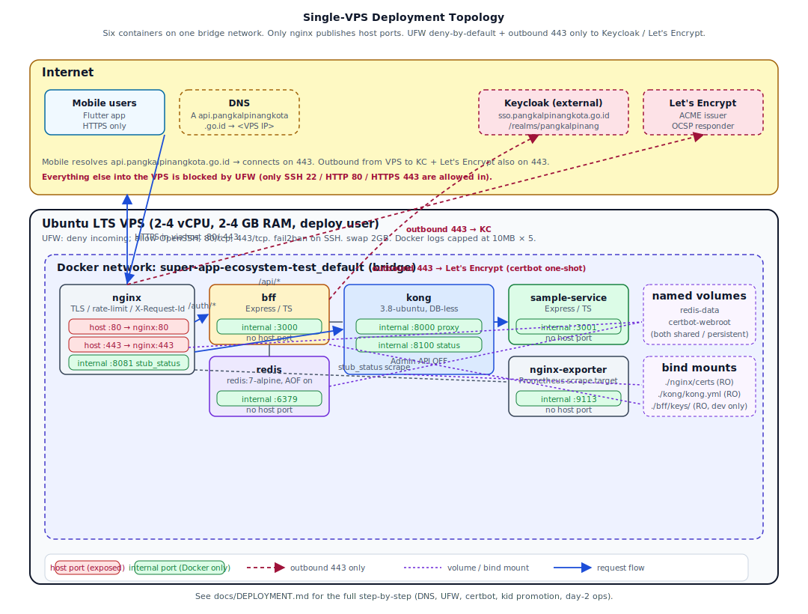

Bootstrapping Let's Encrypt is a chicken-and-egg: HTTP-01 needs nginx
serving `:80` *before* any cert exists. We boot HTTP-only, run certbot
through a shared webroot volume, symlink the issued cert, then flip a
single env flag and recreate only nginx:

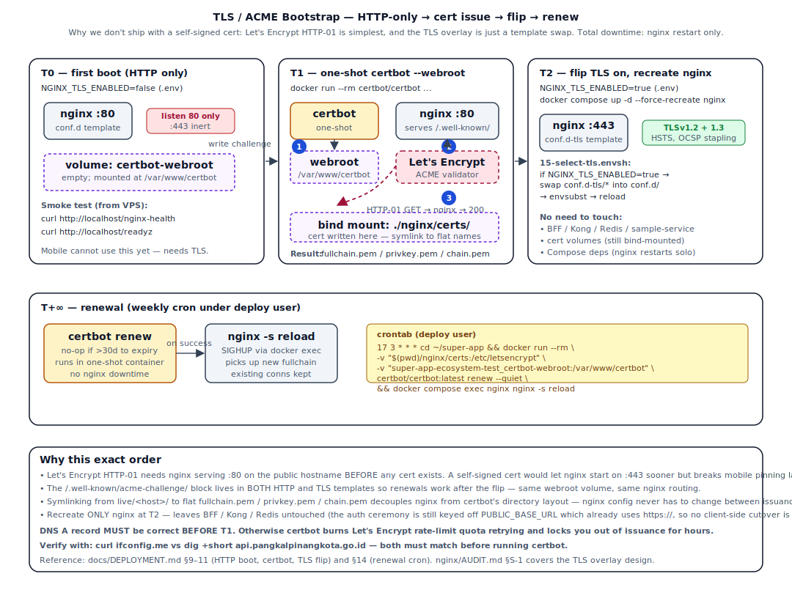

Compose startup order is gated by `service_healthy` so nginx never
forwards before BFF + Kong are actually serving:

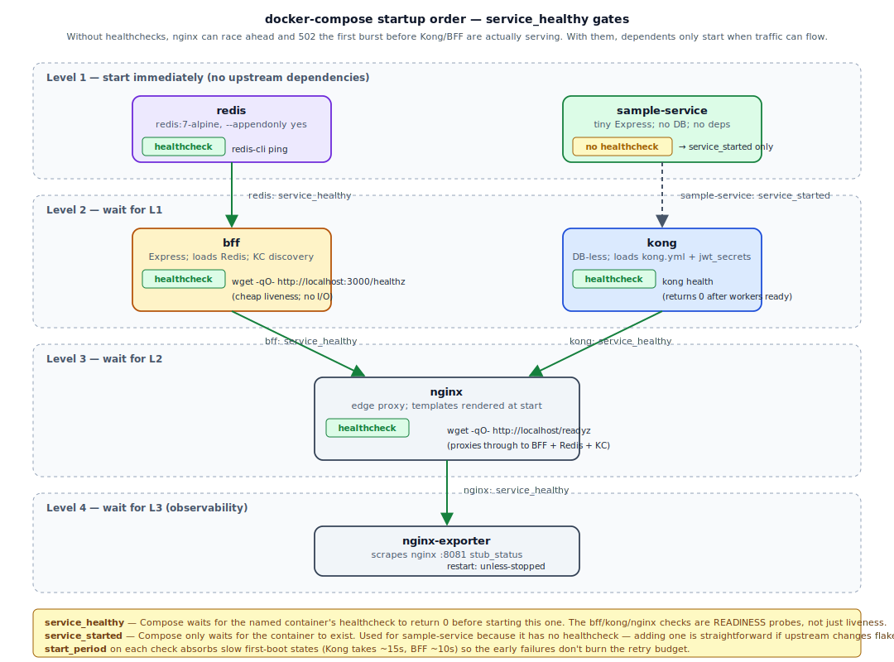

Full step-by-step (DNS, UFW, certbot one-shot command, kid promotion to
`prod-v1`, day-2 ops, rollback) is in
**[`docs/DEPLOYMENT.md`](docs/DEPLOYMENT.md)**.

---

## Per-component documentation

For deeper detail on any one piece, read its own README:

- [`bff/README.md`](bff/README.md) — endpoints, env, Redis keyspace, threat model, key-rotation runbook.
- [`nginx/README.md`](nginx/README.md) — routing, rate-limit zones, health probes, TLS overlay, metrics.
- [`kong/README.md`](kong/README.md) — JWT validation, identity injection, plugin matrix, sandbox config, kid rotation.
- [`services/sample-service/README.md`](services/sample-service/README.md) — reference microservice.
- [`mobile/README.md`](mobile/README.md) — Flutter app.
- [`docs/auth-architecture.md`](docs/auth-architecture.md) — token model, flow narratives, tradeoffs.
- [`docs/adding-a-service.md`](docs/adding-a-service.md) — step-by-step guide for adding a new authenticated or public service behind Kong.

---

## Audit & improvement docs

- [`nginx/AUDIT.md`](nginx/AUDIT.md) — 24 findings; close-out summary at the top.
- [`kong/AUDIT.md`](kong/AUDIT.md) — Kong configuration audit.
- [`bff/docs/AUDIT_2026-05-13.md`](bff/docs/AUDIT_2026-05-13.md) — most recent BFF audit.
- [`bff/docs/IMPROVEMENT_PLAN.md`](bff/docs/IMPROVEMENT_PLAN.md) — BFF roadmap.

---

## Diagram index

All 15 diagrams are in [`docs/diagrams/`](docs/diagrams/) as plain SVGs.
GitHub renders them inline; any markdown viewer will too. They are
referenced in context above; here's the master index for direct access:

| # | File | Section above |
|---|---|---|
| 1 | [`architecture-overview.svg`](docs/diagrams/architecture-overview.svg) | Architecture at a glance |
| 2 | [`two-plane-model.svg`](docs/diagrams/two-plane-model.svg) | Two-plane mental model |
| 3 | [`flow-login.svg`](docs/diagrams/flow-login.svg) | Login |
| 4 | [`flow-refresh.svg`](docs/diagrams/flow-refresh.svg) | Refresh |
| 5 | [`flow-logout.svg`](docs/diagrams/flow-logout.svg) | Logout |
| 6 | [`flow-data-plane-request.svg`](docs/diagrams/flow-data-plane-request.svg) | Every-request path |
| 7 | [`kong-identity-injection.svg`](docs/diagrams/kong-identity-injection.svg) | Kong identity injection |
| 8 | [`internal-jwt-lifecycle.svg`](docs/diagrams/internal-jwt-lifecycle.svg) | The internal JWT |
| 9 | [`trust-boundaries.svg`](docs/diagrams/trust-boundaries.svg) | Trust boundaries |
| 10 | [`redis-keyspace.svg`](docs/diagrams/redis-keyspace.svg) | Redis keyspace |
| 11 | [`request-id-correlation.svg`](docs/diagrams/request-id-correlation.svg) | Request correlation |
| 12 | [`mobile-architecture.svg`](docs/diagrams/mobile-architecture.svg) | Mobile app structure |
| 13 | [`deployment-vps-topology.svg`](docs/diagrams/deployment-vps-topology.svg) | Deployment |
| 14 | [`tls-acme-bootstrap.svg`](docs/diagrams/tls-acme-bootstrap.svg) | Deployment (TLS) |
| 15 | [`compose-startup-order.svg`](docs/diagrams/compose-startup-order.svg) | Deployment (compose order) |

---

## License

Unspecified. Internal use only until a license is added.
